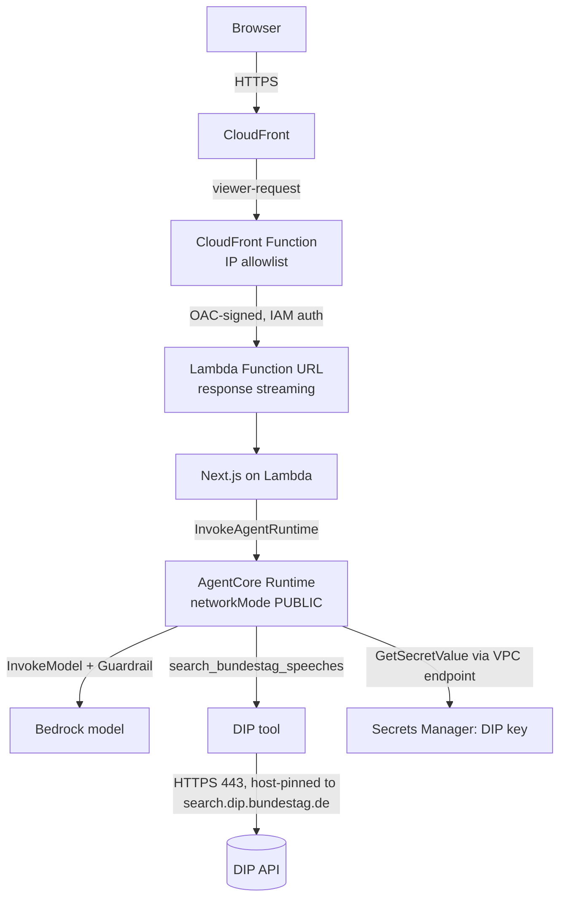

# Architecture

## Components

| Component | Tech | Where | Purpose |
| --- | --- | --- | --- |
| Frontend | Next.js (App Router, TS) | AWS Lambda (container) behind a streaming Function URL | Single white page, one input; server route invokes the agent |
| Edge / access control | CloudFront + CloudFront Function | global | TLS, HTTP/2+3, and an IP allowlist (only permitted client IPs) |
| Agent | Strands Agents SDK (Python) | Bedrock AgentCore Runtime (VPC mode) | Answers ONLY via the DIP tool, with Guardrail on every call |
| Tool | `search_bundestag_speeches` | inside the agent | Wraps DIP API endpoints; the only outbound integration |
| Guardrail | Bedrock Guardrail | attached to model | Topic lock, injection block, PII, grounding |
| Egress control | Application-layer host pinning (DIP client) | Agent | Only `search.dip.bundestag.de:443` is reachable |
| IaC | AWS CDK (TypeScript) | `/infra` | Reproducible provisioning of everything |

## Request flow



## Network topology

The frontend is **serverless** (Lambda) and runs outside the VPC; the AgentCore runtime runs
outside the VPC too (`networkMode: PUBLIC`). The VPC remains only for the isolated workload
subnets and their interface VPC endpoints:

```
VPC 10.42.0.0/16  (2 AZs)
├── public subnets    (/26)  : IGW route (currently unused by the frontend)
└── workload subnets  (/22)  : interface VPC endpoints (fully isolated, no internet route)
```

AWS service calls (Bedrock, Secrets Manager, Logs, ECR, STS, S3) use VPC endpoints and never
leave the AWS network. External egress to the DIP API is restricted at the application layer by
the DIP client, which host-pins to `search.dip.bundestag.de`.

> Note: to reduce cost, the AWS Network Firewall, the NAT gateways, and the AWS WAF were
> removed. The frontend runs as a single always-on ECS Fargate task behind an ALB and
> CloudFront (`frontend-stack.ts`, `desiredCount: 1` — it does **not** scale to zero);
> access control is Cognito authentication in the application, and external egress is
> controlled by the per-Lambda host allowlists in the shared pinned HTTP client
> (`lambdas/shared/python/gov_debates/http/pinned_client.py`).

## Why these choices

- **Fargate (not Lambda) for the frontend**: the chat streams answers over SSE, which wants
  a long-lived HTTP server; a standalone Next.js container behind an ALB does that without
  response-size/timeout gymnastics, at the price of one always-on task.
- **Origin lockdown instead of an edge allowlist**: the ALB admits only CloudFront's
  origin-facing prefix list and requires the CloudFront-injected secret origin header;
  user-level access control is Cognito, enforced per request in the app.
- **Application-layer host pinning** in the shared HTTP client restricts each adapter
  Lambda's external egress to its own allowlisted FQDNs, without the cost of always-on
  Network Firewall endpoints and NAT gateways.
- **Guardrail + system prompt** give belt-and-suspenders topic enforcement (model-side and
  service-side).

See [`security-model.md`](security-model.md) for the threat model.
